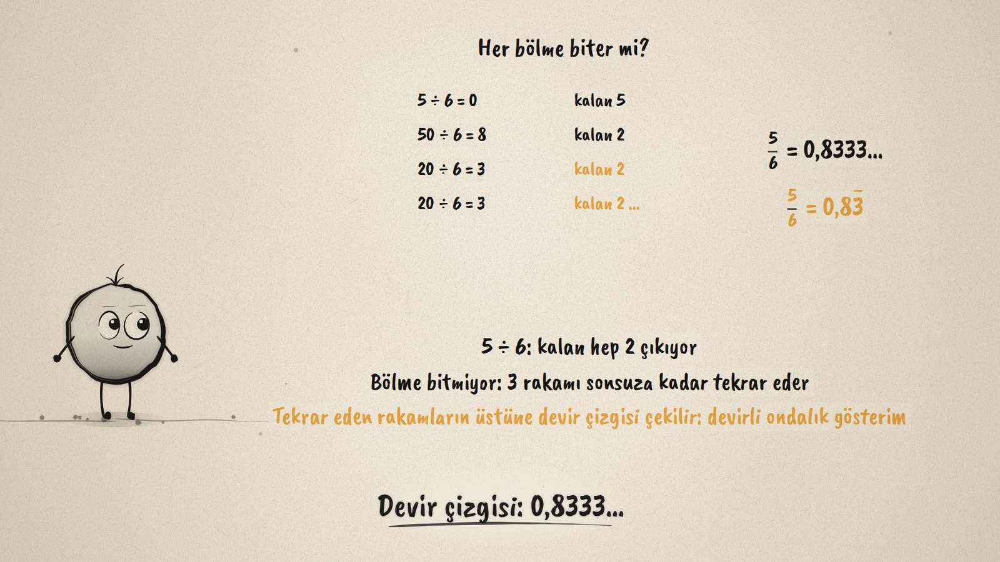
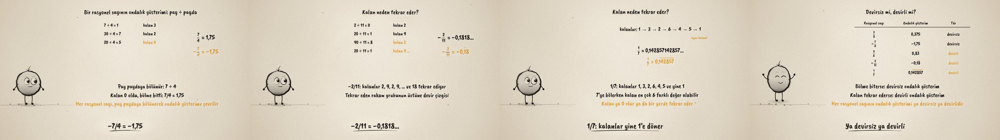

# Devir Çizgisi · Decimal Forms of Rational Numbers

**▶ Tarayıcıda izleyin / Watch in the browser:** https://hakanatas.github.io/devir-cizgisi/ 
**⬇ MP4 + altyazılar / MP4 + subtitles:** [Releases](https://github.com/hakanatas/devir-cizgisi/releases) 
**✎ Kullanılan istem / The prompt behind it:** [PROMPT.md](PROMPT.md) 
**🎞 Bütün filmler / All films:** [Nokta'nın Filmleri](https://hakanatas.github.io/nokta-filmleri/?sinif=7)

> **TR —** 7. sınıf matematik "Sayılar ve Nicelikler (1)" temasındaki MAT.7.1.2 öğrenme çıktısı için hazırlanmış, tamamen JavaScript ile çizilen 92 saniyelik mürekkep animasyonu. Sıcaklık 4 saatte 7 derece düşüyor (+3 °C'tan −4 °C'a): saatte −7/4 derece. Pay paydaya bölünüyor: 7 ÷ 4 adım adım, kalan 0 olunca bölme bitiyor; −7/4 = −1,75. 5 ÷ 6'da kalan hep 2 çıkıyor, 3 rakamı sonsuza kadar tekrar ediyor: 0,8333…; tekrar eden rakamın üstüne devir çizgisi çekiliyor. −2/11'de kalanlar 2, 9, 2, 9 diye dönüyor ve 18 devrediyor. 1/7'de kalanlar 1, 3, 2, 6, 4, 5 ve yine 1: 7'ye bölerken kalan en çok 6 farklı değer alabildiği için kalan ya 0 olur ya da bir yerde tekrar eder. Son olarak bir tabloda 3/8, −7/4, 5/6, −2/11 ve 1/7 devirsiz ya da devirli diye ayrılıyor: her rasyonel sayının ondalık gösterimi ya devirsiz ya da devirlidir. Altyazılar Türkçe, İngilizce ya da ikisi birlikte seçilebilir.

A 92-second ink animation for **7th-grade maths**. Nokta, the ink character from [The Learning Ink](https://github.com/hakanatas/the-learning-ink), is the guide again. Every division is shown as its steps with their remainders (`steps` in `scenes/scene1.js`); a remainder that has appeared before turns amber, and that is the moment the digits start to repeat. Repeating blocks get a hand-drawn bar (`dec`).

## Learning outcome

MEB, Türkiye Yüzyılı Maarif Modeli, Ortaokul Matematik, 7th grade, "Sayılar ve Nicelikler (1)" theme:

**MAT.7.1.2. Gerçek yaşam durumlarında rasyonel sayıların ondalık gösterimlerini yansıtabilme**
- a) Bölme işlemini kullanarak her rasyonel sayının bir ondalık gösterimi olduğunu inceler.
- b) Rasyonel sayıların ondalık gösterimlerinden bazılarının devirli olduğuna dair çıkarım yapar.
- c) Her rasyonel sayının devirli ya da devirsiz ondalık açılımları olduğunu değerlendirir.

## Scenes

| # | Time | Scene | What happens | Outcome |
|---|---|---|---|---|
| 1 | 0–10 s | Saatte kaç derece? | From +3 °C to −4 °C in 4 hours: −7/4 degrees an hour. | a |
| 2 | 10–28 s | Devirsiz | 7 ÷ 4 step by step, remainder 0: −7/4 = −1.75. | a |
| 3 | 28–46 s | Devirli | 5 ÷ 6: the remainder is always 2, so 0.8333…; the repeating bar. | b |
| 4 | 46–64 s | Kalanlar | −2/11 = −0.1818…; the remainders of 1/7 come back to 1. | b |
| 5 | 64–80 s | Devirsiz mi, devirli mi? | A table of 3/8, −7/4, 5/6, −2/11, 1/7. | c |
| 6 | 80–92 s | Aklında kalsın | Divide, watch the remainder, bar the repeating digits. | a–c |

## Running it

- **Preview:** double-click `index.html` (it works offline).
- **MP4:** run `npm install` once, then `npm run export -- --format=horizontal --captions=tr`.
- **Subtitles and narration:** `npm run srt` writes `out/captions_*.srt` and `narration_notes.txt`.
- **Editing:**
  - Caption text, timings and narration notes: `captions.js`
  - Everything on screen is drawn by `LI.world(t)` in `scenes/scene1.js` (the thermometer, the division steps, the decimals, the table, the words); the other scenes only set the camera.
  - Nokta's poses: `src/draw/film.js`; layout for 16:9 and 9:16: `src/draw/kd.js`

It uses the same engine as The Learning Ink: `renderFrame(t)` as a pure function of time, seeded randomness, and frame-by-frame export.
